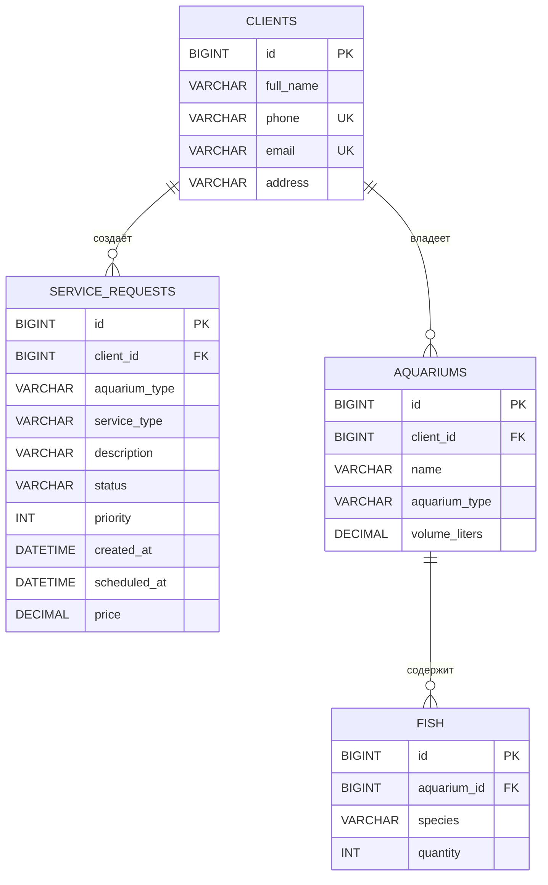

# ER-диаграмма

```mermaid
erDiagram
    CLIENTS ||--o{ SERVICE_REQUESTS : "создаёт"
    CLIENTS ||--o{ AQUARIUMS : "владеет"
    AQUARIUMS ||--o{ FISH : "содержит"
    AQUARIUMS {
        BIGINT id PK
        BIGINT client_id FK
        VARCHAR name
        VARCHAR aquarium_type
        DECIMAL volume_liters
    }
    FISH {
        BIGINT id PK
        BIGINT aquarium_id FK
        VARCHAR species
        INT quantity
    }

    CLIENTS {
        BIGINT id PK
        VARCHAR full_name
        VARCHAR phone UK
        VARCHAR email UK
        VARCHAR address
    }

    SERVICE_REQUESTS {
        BIGINT id PK
        BIGINT client_id FK
        VARCHAR aquarium_type
        VARCHAR service_type
        VARCHAR description
        VARCHAR status
        INT priority
        DATETIME created_at
        DATETIME scheduled_at
        DECIMAL price
    }
```
